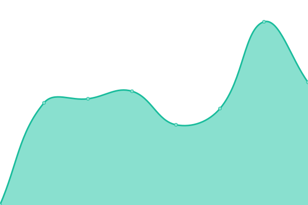
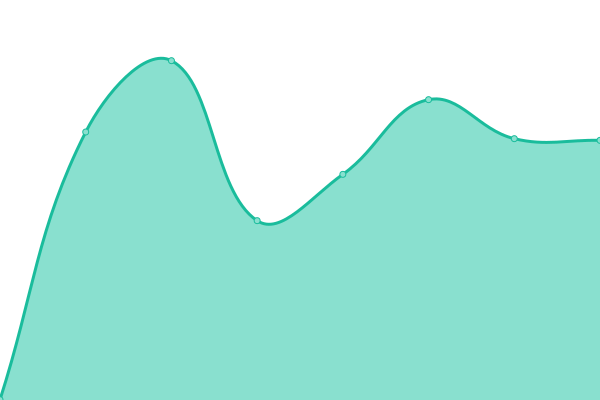

# [📈 Live Status](https://up.t00ls.eu): <!--live status--> **🟩 All systems operational**

This repository contains the open-source uptime monitor and status page for [t00ls.eu](https://t00ls.eu.github.io/upptime), powered by [Upptime](https://github.com/upptime/upptime).

With [Upptime](https://upptime.js.org), you can get your own unlimited and free uptime monitor and status page, powered entirely by a GitHub repository. We use [Issues](https://github.com/koenbeek/upptime/issues) as incident reports, [Actions](https://github.com/koenbeek/upptime/actions) as uptime monitors, and [Pages](https://koenbeek.github.io/upptime) for the status page.

<!--start: status pages-->
<!-- This summary is generated by Upptime (https://github.com/upptime/upptime) -->
<!-- Do not edit this manually, your changes will be overwritten -->
<!-- prettier-ignore -->
| URL | Status | History | Response Time | Uptime |
| --- | ------ | ------- | ------------- | ------ |
|  [Web tools](https://www.t00ls.eu) | 🟩 Up | [web-tools.yml](https://github.com/koenbeek/upptime/commits/HEAD/history/web-tools.yml) | 

 779ms
     
 | 

<a href="https://up.t00ls.eu/history/web-tools">98.51%</a>
    

|  [assets overview](https://assets.t00ls.eu) | 🟩 Up | [assets-overview.yml](https://github.com/koenbeek/upptime/commits/HEAD/history/assets-overview.yml) | 

 1280ms
     
 | 

<a href="https://up.t00ls.eu/history/assets-overview">98.51%</a>
    

|  [Assets API backend](https://assets.t00ls.eu/api/management/health) | 🟩 Up | [assets-api-backend.yml](https://github.com/koenbeek/upptime/commits/HEAD/history/assets-api-backend.yml) | 

 144ms
     
 | 

<a href="https://up.t00ls.eu/history/assets-api-backend">98.52%</a>
    

|  [Nextcloud](https://cloud.t00ls.eu) | 🟩 Up | [nextcloud.yml](https://github.com/koenbeek/upptime/commits/HEAD/history/nextcloud.yml) | 

 1345ms
     
 | 

<a href="https://up.t00ls.eu/history/nextcloud">98.52%</a>
    

|  [EU electricity prices](https://el.t00ls.eu) | 🟩 Up | [eu-electricity-prices.yml](https://github.com/koenbeek/upptime/commits/HEAD/history/eu-electricity-prices.yml) | 

 1808ms
     
 | 

<a href="https://up.t00ls.eu/history/eu-electricity-prices">98.52%</a>
    

<!--end: status pages-->

[**Visit our status website →**](https://koenbeek.github.io/upptime)

## 📄 License

- Powered by: [Upptime](https://github.com/upptime/upptime)
- Code: [MIT](./LICENSE) © [Anand Chowdhary](https://anandchowdhary.com), supported by [Pabio](https://pabio.com)
- Data in the `./history` directory: [Open Database License](https://opendatacommons.org/licenses/odbl/1-0/)
